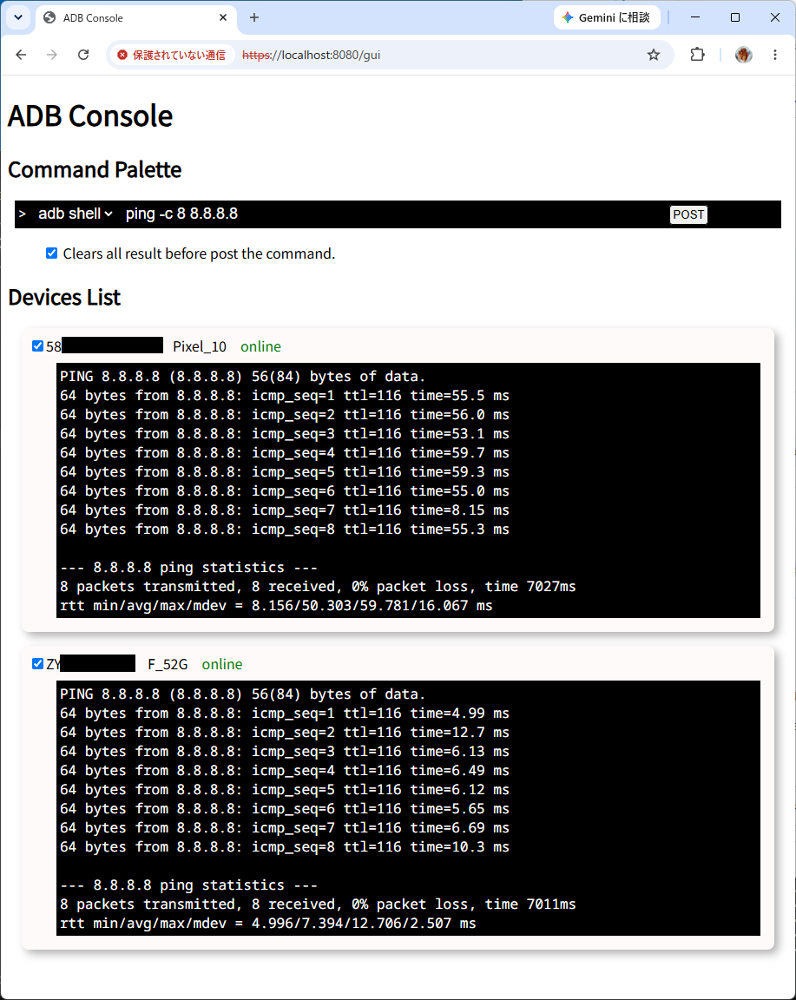

# ADB Console Tool


[](https://github.com/machidashibu/adbcon/actions/workflows/build.yaml)
[](https://github.com/machidashibu/adbcon/actions/workflows/test.yaml)


This tool provides GUI for ADB command on WEB browser.
***adbcon*** is an acronym of ***ADB Console***.

> [!CAUTION]
> This tool accesses local resources (e.g., smartphones, local storage). You **MUST NOT** expose the TCP port used by this tool to the internet.

## Screenshot



## Get started

### Build

Execute following command, executable file is generated. (`adbcon.exe` for windows)

```bash
$ go build
```

### Run

Run the generated executable file.

```bash
$ adbcon
```

Access to `https://localhost:8080/gui` by WEB browser.

You may ignore if the browser notifies means "access to not secure page".

### References

* [Open API v3.0.4](https://spec.openapis.org/oas/v3.0.4.html)
* [oapi-codegen](https://github.com/oapi-codegen) - Apache-2.0 license
* [Echo v4](https://echo.labstack.com/) - MIT license
